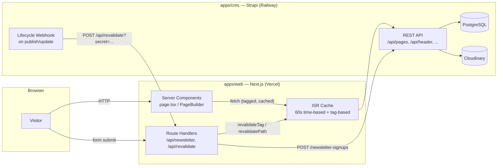
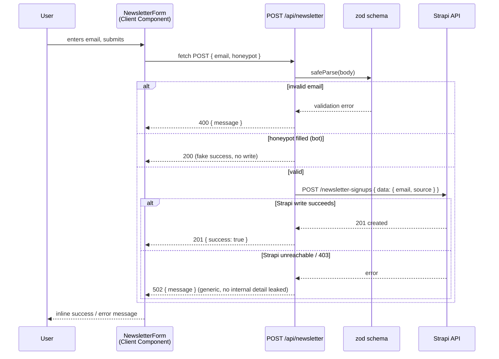
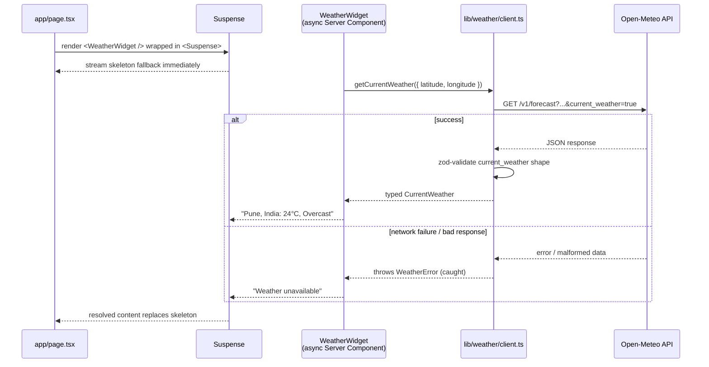

# GO MO Group — Full Stack Developer Assignment

A CMS-driven marketing homepage rebuilt from a Figma design. Every piece of user-facing content
— headings, CTAs, images, footer, navigation, SEO metadata — is managed through a headless CMS
via a **dynamic, reorderable page-builder**, not hardcoded in the frontend. Built as a 24-hour
take-home assignment; this document reflects the codebase as it actually stands.

## Table of Contents

- [Overview](#overview)
- [Features](#features)
- [Tech Stack](#tech-stack)
- [Architecture](#architecture)
- [Folder Structure](#folder-structure)
- [Installation](#installation)
- [Environment Variables](#environment-variables)
- [Running Locally](#running-locally)
- [Production Build](#production-build)
- [Strapi CMS Setup](#strapi-cms-setup)
- [Newsletter Flow](#newsletter-flow)
- [Weather Integration](#weather-integration)
- [API Routes](#api-routes)
- [Security Decisions](#security-decisions)
- [Performance Optimizations](#performance-optimizations)
- [Deployment](#deployment)
- [Assignment Checklist](#assignment-checklist)
- [Future Improvements](#future-improvements)
- [Author](#author)

## Overview

`apps/web` is a Next.js (App Router) frontend that renders a homepage entirely from content
fetched out of `apps/cms`, a Strapi instance. The homepage is a Strapi **Dynamic Zone**: an
editor can add, remove, or drag-reorder any of 7 section types in the Strapi admin, and the
frontend re-renders in that exact order with zero code changes — the actual mechanism a
"page-builder" is supposed to demonstrate, not a simulation of one.

Beyond the CMS-driven homepage, the project includes a custom backend API endpoint (newsletter
signup), an external third-party API integration (live weather), on-demand + time-based ISR,
dynamic SEO metadata, and a generated sitemap/robots.txt.

## Features

- **Dynamic Page Builder** — homepage sections are a Strapi Dynamic Zone; `PageBuilder.tsx`
  dispatches each `__component` to its typed React component via a switch statement. Reordering
  or deleting a section in Strapi reflects on the live site without a redeploy.
- **7 homepage sections**, each fully CMS-driven: Hero (image or video background), Intro Stats
  (stats row + draggable brand-logo carousel), Why Choose Us, Industry Showcase (click-to-swap
  sidebar), Case Studies (scroll-snap carousel with dot pagination), Insights Grid, CTA Banner.
- **Global CMS singletons**: Header (nav with dropdowns), Footer (link columns, contact block,
  newsletter, social links, ISO badges, legal bar), Global (site-wide SEO defaults).
- **Newsletter signup** — real POST endpoint backed by Strapi, with server-side validation and
  spam protection (see [Newsletter Flow](#newsletter-flow)).
- **Live weather widget** — external API integration (Open-Meteo), independent of the CMS.
- **ISR (Incremental Static Regeneration)** — 60s time-based revalidation everywhere, plus an
  on-demand webhook endpoint so a Strapi publish reflects immediately instead of waiting.
- **Dynamic SEO** — per-page `generateMetadata`, OG/Twitter cards, a CMS-driven `sitemap.xml`,
  and `robots.txt`.
- **Responsive, accessible UI** — mobile nav, keyboard-accessible dropdowns
  (`group-focus-within`), no dead `href="#"` links, semantic list markup.
- **Cache-busting for replaced media** — Strapi's in-place media "replace" keeps the same URL, so
  `updatedAt` is appended as a `?v=` query param wherever media is rendered.

## Tech Stack

| Layer               | Technology                                                              |
| ------------------- | ----------------------------------------------------------------------- |
| Frontend framework  | Next.js 16 (App Router, Turbopack) + React 19                           |
| Styling             | Tailwind CSS v4 (CSS-first `@theme` config)                             |
| Language            | TypeScript (strict)                                                     |
| Validation          | Zod                                                                     |
| CMS                 | Strapi 5 (Node.js, Dynamic Zones)                                       |
| Database (CMS)      | SQLite (dev) / PostgreSQL (production)                                  |
| Media storage (CMS) | Local disk (dev) / Cloudinary (production)                              |
| External API        | Open-Meteo (free, no API key)                                           |
| Monorepo            | npm workspaces                                                          |
| Formatting/Linting  | ESLint (`eslint-config-next`), Prettier + `prettier-plugin-tailwindcss` |

## Architecture

Two independently-deployable apps in one npm-workspaces monorepo. The frontend never talks to a
database directly — it only ever calls Strapi's REST API, server-side, through one typed fetch
wrapper (`lib/strapi/client.ts`).



**Key architectural decisions:**

- **Bounded `populate` over `populate=deep`.** `lib/queries/get-page.ts` builds an explicit
  `populate` object (via the `qs` library) naming exactly which relations/media each of the 7
  section types needs. This avoids over-fetching and keeps the query auditable.
- **A `switch`, not an object registry, for `PageBuilder`.** Each case narrows `section` to its
  exact Strapi type, so `<Hero {...section} />` receives fully-typed props instead of a loosely
  typed common shape. An unrecognized `__component` is skipped with a dev-only warning rather
  than crashing — forward-compatible with new section types added in the CMS before the frontend
  catches up.
- **Server Components by default; Client Components only where genuinely interactive** —
  `MobileNav`, `NewsletterForm`, `BrandsScroller` (drag-to-scroll), `IndustrySwitcher`
  (click-to-swap), `CaseStudiesCarousel` (dot pagination), `error.tsx`. Every other section is a
  Server Component that resolves Strapi media URLs server-side before handing plain data down.
- **`server-only` guard** on `lib/strapi/client.ts` and `lib/strapi/media.ts` — the Strapi API
  token can never end up in a client bundle, enforced at build time, not just by convention.

## Folder Structure

```
gomo-fullstack-assignment/
├── apps/
│   ├── web/                          # Next.js frontend
│   │   ├── src/
│   │   │   ├── app/
│   │   │   │   ├── page.tsx               # homepage (slug "home")
│   │   │   │   ├── [slug]/page.tsx        # generic CMS page route
│   │   │   │   ├── layout.tsx             # root layout, fonts, Header/Footer
│   │   │   │   ├── loading.tsx / error.tsx / not-found.tsx
│   │   │   │   ├── sitemap.ts / robots.ts
│   │   │   │   └── api/
│   │   │   │       ├── newsletter/route.ts
│   │   │   │       └── revalidate/route.ts
│   │   │   ├── components/
│   │   │   │   ├── ui/                    # Container, Button, Kicker, SectionHeading...
│   │   │   │   ├── layout/                # Header, Footer, MobileNav, NewsletterForm
│   │   │   │   ├── sections/               # Hero, IntroStats, WhyChooseUs, IndustryShowcase,
│   │   │   │   │                           # CaseStudies(+Carousel), InsightsGrid, CtaBanner
│   │   │   │   ├── PageBuilder.tsx        # __component → component dispatch
│   │   │   │   └── WeatherWidget.tsx
│   │   │   └── lib/
│   │   │       ├── strapi/                # client.ts, types.ts, media.ts (server-only)
│   │   │       ├── queries/               # get-page, get-header, get-footer, get-global
│   │   │       ├── mutations/             # newsletter.ts
│   │   │       ├── validation/            # newsletter.ts (zod schema)
│   │   │       ├── weather/               # client.ts, conditions.ts
│   │   │       └── seo.ts
│   │   ├── next.config.ts
│   │   └── .env.example
│   └── cms/                          # Strapi backend
│       ├── src/
│       │   ├── api/                       # page, header, footer, global, industry,
│       │   │                              # case-study, insight, brand, newsletter-signup
│       │   └── components/
│       │       ├── sections/               # hero, intro-stats, why-choose-us,
│       │       │                           # industry-showcase, case-studies-carousel,
│       │       │                           # insights-grid, cta-banner, stat-item, feature-item
│       │       ├── layout/                 # nav-item, footer-column, link, social-link
│       │       └── shared/seo.json
│       ├── config/                        # database.ts, plugins.ts, middlewares.ts
│       └── .env.example
├── package.json                      # npm workspaces root
└── README.md
```

## Installation

Requires **Node.js 20.x** (Strapi 5's declared engine range; Next.js 16 also requires ≥20.9).

```bash
git clone <repo-url>
cd gomo-fullstack-assignment
npm install
```

This installs both workspaces (`apps/web`, `apps/cms`) from the single root lockfile.

## Environment Variables

### `apps/web/.env.local` (copy from `.env.example`)

| Variable               | Description                                                                                                                               |
| ---------------------- | ----------------------------------------------------------------------------------------------------------------------------------------- |
| `STRAPI_URL`           | Base URL of the Strapi instance (`http://localhost:1337` in dev)                                                                          |
| `STRAPI_API_TOKEN`     | Strapi API token. Needs **read** access for content queries and **create** access on `newsletter-signup` for the newsletter route to work |
| `REVALIDATE_SECRET`    | Shared secret checked by `/api/revalidate` before honoring a webhook call                                                                 |
| `NEXT_PUBLIC_SITE_URL` | Public site origin, used in metadata, `sitemap.ts`, and JSON-LD                                                                           |

### `apps/cms/.env` (copy from `apps/cms/.env.example`)

| Variable                                                                                                | Description                                                                                                                          |
| ------------------------------------------------------------------------------------------------------- | ------------------------------------------------------------------------------------------------------------------------------------ |
| `APP_KEYS`, `API_TOKEN_SALT`, `ADMIN_JWT_SECRET`, `TRANSFER_TOKEN_SALT`, `JWT_SECRET`, `ENCRYPTION_KEY` | Strapi's own secrets — auto-generated by the Strapi CLI scaffold, must be unique per environment                                     |
| `DATABASE_CLIENT`                                                                                       | `sqlite` in dev, `postgres` in production                                                                                            |
| `DATABASE_URL`                                                                                          | Postgres connection string (production only)                                                                                         |
| `DATABASE_FILENAME`                                                                                     | SQLite file path (dev only, defaults to `.tmp/data.db`)                                                                              |
| `CLOUDINARY_NAME` / `CLOUDINARY_KEY` / `CLOUDINARY_SECRET`                                              | Set all three to switch media storage from local disk to Cloudinary — required in production since Railway's filesystem is ephemeral |
| `CORS_ORIGIN`                                                                                           | Comma-separated list of allowed frontend origins (the deployed Next.js URL in production)                                            |

## Running Locally

```bash
# Terminal 1 — Strapi CMS
npm run cms:dev
# → http://localhost:1337/admin (create the first admin user on initial run)

# Terminal 2 — Next.js frontend
npm run dev
# → http://localhost:3000
```

On first run, log into the Strapi admin, create content for the `page` (slug `home`), `header`,
`footer`, and `global` singletons, and generate a scoped API token
(**Settings → API Tokens → Create new API Token**) for `STRAPI_API_TOKEN`.

## Production Build

```bash
npm run build      # builds apps/web (next build)
npm run lint        # eslint over apps/web
npm run cms:build   # builds the Strapi admin panel
```

`npm run build` type-checks the whole frontend as part of the Next.js build — a type error fails
the build, not just lint.

## Strapi CMS Setup

**Content model:**

| Type                | Kind       | Purpose                                                                                            |
| ------------------- | ---------- | -------------------------------------------------------------------------------------------------- |
| `page`              | Collection | `slug`, `title`, `seo` (component), `sections` (Dynamic Zone — the page-builder field)             |
| `header`            | Single     | Logo, `navItems` (with nested dropdown children), CTA button                                       |
| `footer`            | Single     | Wordmark, link `columns`, contact block, newsletter copy, `socialLinks`, `isoBadges`, `legalLinks` |
| `global`            | Single     | Site-wide SEO defaults                                                                             |
| `industry`          | Collection | Powers the Industry Showcase sidebar                                                               |
| `case-study`        | Collection | Powers the Case Studies carousel                                                                   |
| `insight`           | Collection | Powers the Insights Grid                                                                           |
| `brand`             | Collection | Client logos in Intro Stats                                                                        |
| `newsletter-signup` | Collection | Written to by the newsletter API route; no admin-side editing needed                               |

**Dynamic Zone components** (`page.sections` can contain any mix, in any order, of):
`hero`, `intro-stats`, `why-choose-us`, `industry-showcase`, `case-studies-carousel`,
`insights-grid`, `cta-banner`.

**Media uploads**: local disk by default; set the three `CLOUDINARY_*` env vars to switch
providers with zero code changes (`config/plugins.ts` picks the provider based on whether those
vars are present).

**Access model**: the `Public` role is left closed (Strapi's secure default). The frontend
authenticates every request with a scoped **API token** instead — created once, manually, from
the admin (Settings → API Tokens), matching the assignment's "least privilege" expectation more
than opening the Public role would.

**On-demand revalidation**: add a webhook in Strapi admin (**Settings → Webhooks**) pointed at
`https://<your-site>/api/revalidate?secret=<REVALIDATE_SECRET>`, firing on entry
create/update/publish/unpublish for `page`, `header`, `footer`, and `global`.

## Newsletter Flow

The Footer's newsletter form posts to a real backend endpoint, which writes into Strapi's
`newsletter-signup` collection.



**Notes:**

- Validation (`lib/validation/newsletter.ts`) trims/lowercases the email before checking its
  format, so `" User@Example.com "` normalizes instead of failing on whitespace.
- The honeypot field is visually hidden (not `display:none`, which naive bots skip) and never
  autofilled; a filled honeypot returns a fake success without writing anything or logging the
  value, so scrapers can't tell they were caught.
- `createNewsletterSignup()` (`lib/mutations/newsletter.ts`) is the only mutation call site in the
  app — it reuses the same `strapiFetch()` client every read query uses, extended additively with
  `method`/`body` support (`cache: 'no-store'` for writes; existing GET call sites are unaffected).

## Weather Integration

A small, independent live-data widget (Open-Meteo, free, no API key) demonstrating the external
API requirement — deliberately outside the CMS Dynamic Zone, since it's a live feed, not
editorial content.



**Notes:**

- Wrapped in `<Suspense>` so a slow or unreachable third-party API can never block the rest of the
  homepage from rendering — it resolves independently behind a matching-footprint skeleton.
- The response is parsed with a `zod` schema, not cast with `as` — a malformed or unexpected
  response shape throws a typed `WeatherError` instead of producing runtime `undefined` bugs.
- Cached for 30 minutes (`next: { revalidate: 1800 }`) — appropriate freshness for a homepage
  widget, comfortably inside Open-Meteo's free-tier limits.
- Defaults to Pune, India, but both the client function and the component accept coordinates as a
  parameter — genuinely reusable for another location, not hardcoded to one call site.

## API Routes

| Route             | Method | Purpose                                                                                                      |
| ----------------- | ------ | ------------------------------------------------------------------------------------------------------------ |
| `/api/newsletter` | `POST` | Validates and writes a newsletter signup to Strapi (see [Newsletter Flow](#newsletter-flow))                 |
| `/api/revalidate` | `POST` | Secret-gated webhook target; calls `revalidateTag`/`revalidatePath` based on the Strapi model in the payload |
| `/sitemap.xml`    | `GET`  | Generated from every published `page` entry's slug + `updatedAt`                                             |
| `/robots.txt`     | `GET`  | Points crawlers at the sitemap                                                                               |

## Security Decisions

- **`server-only` import guard** on the Strapi fetch client and media-URL helper — the API token
  cannot be bundled into client-side JavaScript even by accident; it's a build-time error, not a
  code-review reminder.
- **Scoped API token over the `Public` role.** Strapi's `Public` role stays closed; all reads and
  the one write (newsletter) authenticate via a token created once in the admin, so access is
  auditable and revocable without touching code.
- **Zod validation at every external boundary** — the newsletter POST body and the Open-Meteo
  response are both parsed, not trusted. Neither `any` nor an unchecked `as` cast appears at these
  boundaries.
- **Honeypot spam gate** on the public, unauthenticated newsletter endpoint, with a deliberately
  generic error response (`502`) on any Strapi-side failure — no internal error detail, stack
  trace, or upstream status code is ever leaked to the client.
- **Secret-gated revalidation webhook** — `/api/revalidate` rejects immediately if
  `REVALIDATE_SECRET` isn't configured at all, not just on a mismatched value, closing the
  "silently open in an env where the var was forgotten" gap.
- **CORS locked to the frontend's origin** (`config/middlewares.ts`), not the Strapi CORS plugin's
  permissive `*` default.
- **Upload MIME allow/deny list** (`config/plugins.ts`) — executables (`.exe`, `.sh`, Mach-O
  binaries, etc.) are explicitly denied regardless of what the allow-list otherwise permits.
- **No secrets committed.** Both apps ship `.env.example` with placeholder values only; real
  secrets are gitignored.

## Performance Optimizations

- **ISR everywhere** — every Strapi query tags its `fetch` call and defaults to a 60-second
  revalidate window, backed by the on-demand webhook for near-instant publishes.
- **`next/image`** throughout, with explicit `sizes` per breakpoint and `priority` only on the
  Hero image (LCP) — everything else lazy-loads by default.
- **Bounded `populate` queries** (see [Architecture](#architecture)) avoid over-fetching relations
  on every page request.
- **React `fetch` auto-memoization** — `getPageBySlug()` is called from both `generateMetadata`
  and the page body without double-fetching, since Next.js dedupes identical fetches within one
  render pass.
- **`<Suspense>` around the weather widget** so a slow third-party API never blocks the
  CMS-driven content from streaming in.
- **Cache-busted media URLs** (`?v=<updatedAt>`) so Strapi's in-place media replacement can't leave
  the image optimizer permanently serving stale bytes.
- **Static pages where possible** — the homepage and generic `[slug]` route prerender statically
  at build time and revalidate incrementally, rather than rendering on every request.

## Deployment

Two independently deployable apps — Strapi is a persistent Node server, not a serverless
function, so it and the Next.js frontend target different platforms.

**`apps/web` → Vercel**

1. Import the repo, set the **Root Directory** to `apps/web`.
2. Add the environment variables listed under [Environment Variables](#environment-variables).
3. Deploy — `next build` runs automatically; no `output: 'export'` (the API routes need a server
   runtime).

**`apps/cms` → any Node host with a persistent filesystem/Postgres (e.g. Railway)**

1. Provision a PostgreSQL instance; set `DATABASE_CLIENT=postgres` and `DATABASE_URL`.
2. Set the three `CLOUDINARY_*` vars — required in production since the host's filesystem is
   ephemeral and would lose local-disk uploads on redeploy.
3. Set `CORS_ORIGIN` to the deployed Vercel URL.
4. Once both are live, add the revalidation webhook (Strapi admin → Settings → Webhooks) pointed
   at the deployed `/api/revalidate` endpoint, and update `NEXT_PUBLIC_SITE_URL`/`STRAPI_URL` on
   Vercel to the real URLs.

> This repository has not yet been deployed to a live URL — the steps above are the deployment
> plan, not a description of a running instance. `next.config.ts`'s `images.remotePatterns` will
> also need the production Cloudinary hostname added once media moves off local disk.

## Assignment Checklist

| Requirement                      | Status                                                |
| -------------------------------- | ----------------------------------------------------- |
| CMS-driven Dynamic Page Builder  | ✅ 7 section types, fully reorderable in Strapi admin |
| No hardcoded user-facing content | ✅ headings/CTAs/images/SEO/footer all CMS-sourced    |
| Responsive frontend              | ✅ mobile/tablet/desktop breakpoints throughout       |
| Custom backend API endpoint      | ✅ `POST /api/newsletter`                             |
| External API integration         | ✅ Open-Meteo live weather widget                     |
| Dynamic SEO metadata             | ✅ per-page `generateMetadata`, sitemap, robots.txt   |
| ISR / caching                    | ✅ time-based + on-demand webhook revalidation        |
| TypeScript strict, no `any`      | ✅                                                    |
| Lint + production build passing  | ✅                                                    |
| Meaningful, frequent commits     | ✅                                                    |
| Deployment (Vercel + CMS host)   | ❌ not yet deployed                                   |
| README                           | ✅ this document                                      |

## Future Improvements

- **Deploy** both apps (Vercel + a Postgres/Cloudinary-backed Strapi host) — the one item left
  from the original scope.
- **`MobileNav` focus trap + Escape-to-close** — currently opens/closes correctly but doesn't trap
  focus or respond to Escape; flagged during the production-readiness review as a real gap, not
  fixed yet to avoid rushing a focus-trap implementation.
- **Case Studies vs. Insights click-target consistency** — Case Studies cards are click-anywhere;
  Insights cards restrict the click target to "Read more" only. Worth picking one pattern.
- **Untested revalidation webhook** — the payload-parsing logic in `/api/revalidate` has been
  verified by direct `curl`, but not yet against a real Strapi webhook call end-to-end.
- **Language switcher is UI-only** — the Header's "En" dropdown renders but isn't wired to
  anything; Strapi's i18n plugin would be the natural next step if multi-language content becomes
  a real requirement.
- **Search** — not implemented; lowest ROI for a mostly-static marketing homepage per the
  original time-budget plan.
- **Mobile/tablet layouts are best-practice adaptations**, not literal spec matches — only desktop
  Figma frames were provided during the build.

## Author

**Vivek Limbachiya**
GitHub: [@Vivek24051](https://github.com/Vivek24051)
